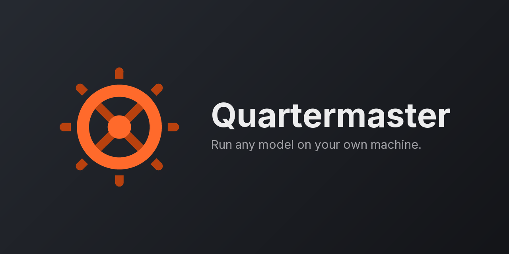

<!-- The ?cacheSeconds= suffix is not decoration. GitHub serves every external
image through camo.githubusercontent.com, which caches by SOURCE URL: while this
repo was private, shields.io got a 404 from the GitHub API and rendered "-", and
camo kept serving those. Changing the URL is the only way to evict them, so if
a badge is ever stuck on stale data, bump this number rather than waiting. -->


# Quartermaster

**Run any model without tuning a single flag.**
*Text, image and audio, all on one machine.*

Quartermaster is an all-in-one local inference platform. Point it at your models folder: it works
out what fits in your VRAM, launches each model with computed flags, and hot-swaps between them on
demand behind one OpenAI- and Anthropic-compatible API.

It is a single Go binary and one YAML file. It does not run models itself: it orchestrates the
inference servers you already trust (llama-server, stable-diffusion.cpp, whisper.cpp, vLLM, TabbyAPI
and anything else that speaks HTTP), decides what fits in your VRAM, launches them with computed
flags, and tears them down when they are idle.

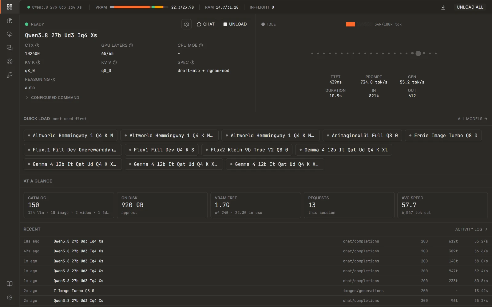

- Runs on your hardware
- Bring your own models
- OpenAI + Anthropic API
- Text, image and audio
- No telemetry

**Website: [quartermaster-labs.github.io/Quartermaster](https://quartermaster-labs.github.io/Quartermaster/)**
for downloads, screenshots and the full user guide.
**[User guide](docs/):** the same help wiki the app ships with, readable before you install anything.

## Contents

- [Why this exists](#why-this-exists)
- [Automatic configuration](#automatic-configuration)
- [Load planning](#load-planning)
- [The playground](#the-playground)
- [Finding and keeping models](#finding-and-keeping-models)
- [Bring your own backend](#bring-your-own-backend)
- [And much more](#and-much-more)
- [Installation](#installation)
- [Configuration](#configuration)
- [How it works](#how-it-works)
- [API surface](#api-surface)
- [Operations](#operations)
- [FAQ](#faq)
- [License and origins](#license-and-origins)

## Why this exists

Every model meant another hand-written block of config: how much context, how many layers on the
GPU, how big the KV cache, whether the experts go on the CPU. Then a new quant lands and you do it
again. Sometimes you want a configuration with high context, other times you want a very lean model
load so something else can share the GPU. That is what the variants system solves.

It started as a fork of [llama-swap](https://github.com/mostlygeek/llama-swap), which had the
swapping right, and grew in the obvious direction from there: read the GGUF header, measure the VRAM
that is actually free, and compute the numbers instead of typing them. Once that worked the rest
followed. Image and audio backends in the same catalog, several ports sharing one scheduler, a
KV-cache that survives being evicted, and a UI that shows what the box is doing rather than a log you
have to tail.

It is its own thing now. It does not track upstream and there is no plan to merge back.

## Automatic configuration

*Config that writes itself, then hands you the pen.*

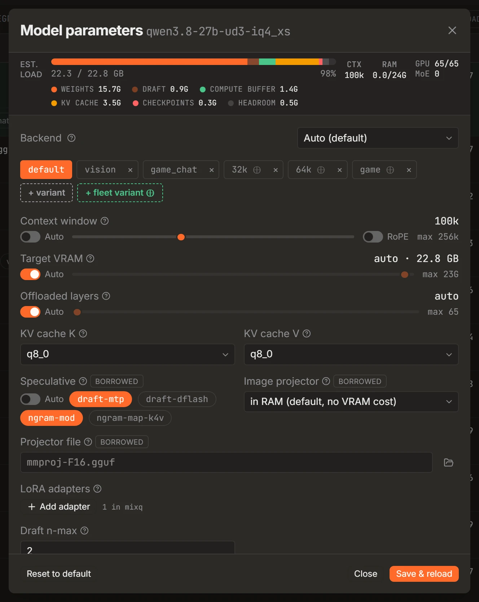

Point it at a folder. Every GGUF is identified from its own header, and context length, GPU offload,
CPU-MoE split and KV-cache sizing are computed per model and per architecture. There is no
hand-written config block per model, and no second block when a new quant lands.

What that means in practice:

- **Per-architecture KV math.** A model's cache cost is not one formula. Gemma's sliding-window
  attention, the recurrent and hybrid layers in Qwen3.5/3.6, LFM2, grouped-query layouts and
  full-attention intervals are each priced the way that architecture actually allocates, rather than
  with a single average that is wrong at both ends.
- **MoE-aware placement.** Expert tensors are the cheapest thing to push to system RAM and the most
  expensive thing to get wrong. The generator derives the expert byte fraction from the model itself
  and picks an `--n-cpu-moe` split from it, instead of you guessing a layer count.
- **Checkpoint and context reservations.** Context checkpoints, the compute buffer and the slot count
  are all part of the budget before a decision is made, not discovered when the driver kills the
  process.
- **Every computed number is an editable field**, not a wall you have to work around. The full
  command line is right there too, and edits to it fold back into the fields above. Flags
  Quartermaster does not model are preserved verbatim: the UI is a layer over the flags, not a
  replacement for them.
- **Named variants.** Save a tuned set and run it alongside the default: a long-context one for
  documents, a lean one for quick calls. Variants of one GGUF group together in the list instead of
  flooding it.
- **Reset anything.** One field, or the whole model, back to what the generator computed.

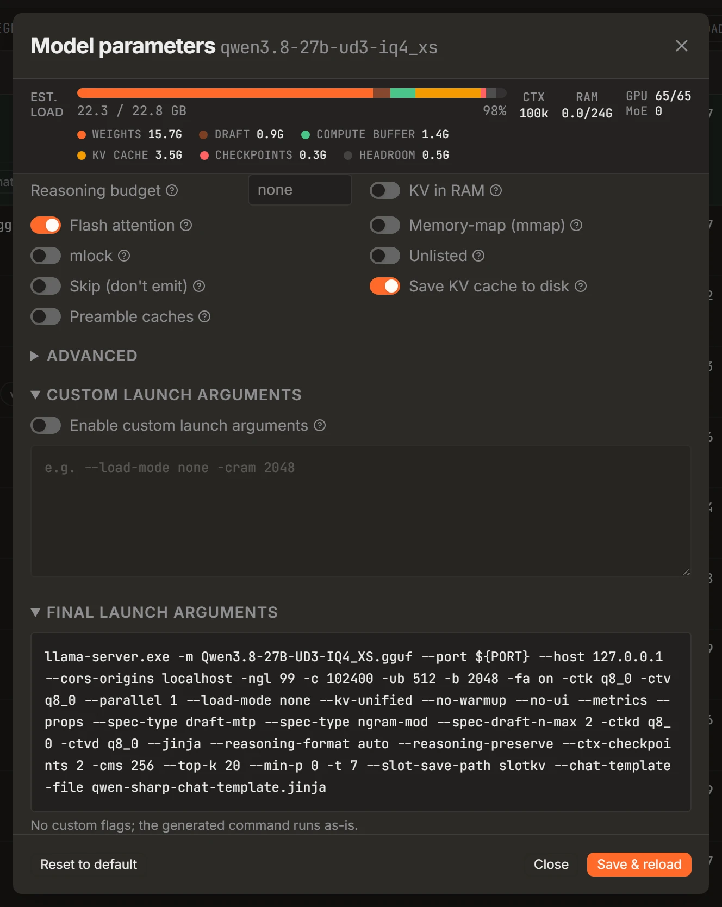

Regenerate at any time with `-generate`, or leave `-watch-models` on and have the folder watched:
models added or removed are picked up and configured without a restart.

## Load planning

*It knows what will fit before it loads it.*

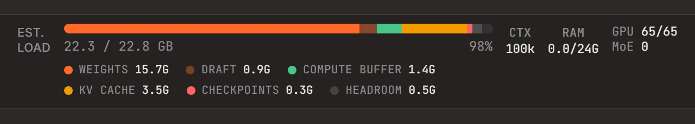

Free VRAM is sampled at startup and every model is sized against what is actually left, not against
the number on the box. The gauge breaks a load down the way the card sees it, so an estimate that is
about to go wrong is visible before you press load rather than after the driver kills the process.

- Weights, KV cache and compute buffer are accounted separately, per architecture.
- The compute buffer is the one large-vocab models silently spill on. It is priced in, including the
  vision tower of a multimodal projector, which is charged at the largest image it can be handed.
- System usage is part of the budget, so the number is what is free for you, not what is free in
  theory.
- VRAM is read live from the platform's own interface: D3DKMT and PDH on Windows (NVIDIA, AMD and
  Intel alike), and the native equivalents on Linux and macOS. Nothing is inferred from a vendor tool
  you have to install first.

## The playground

*A playground, not just a proxy.*

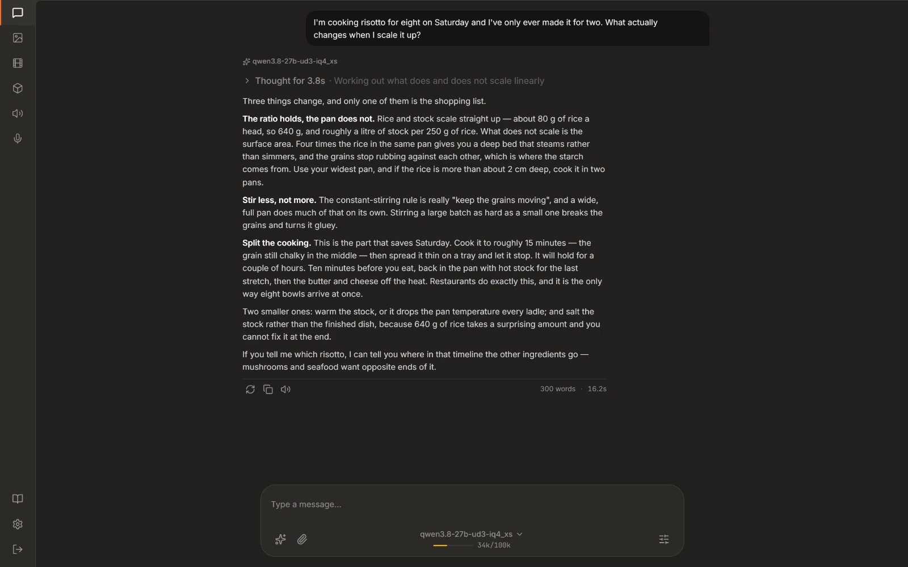

Quartermaster orchestrates llama-server, stable-diffusion.cpp, TTS and transcription servers, rerank
and embedding models, upscaling and segmentation, all behind one OpenAI-compatible surface. Then it
gives you a front end for them, optionally on its own port with per-user login and server-side
history, so a model is not just reachable the moment it is discovered, it is useful, with nothing
else installed in front of it.

- **An everyday helper.** A shopping mode that browses, compares prices and lists the options with
  sources attached. Ask what the weather does tomorrow. Rewrite a piece of text to an instruction and
  read the result as a word-level diff against the original.
- **Web search and tool calling are wired in**, so an answer is not limited to what the weights
  happen to remember. `web_search` and `fetch_page` are proxied server-side, which keeps API keys out
  of the browser and sidesteps CORS entirely. Providers are an ordered failover chain: your own
  [SearXNG](https://github.com/searxng/searxng) instance first (keyless and local), then Brave,
  Tavily, DuckDuckGo or Google behind it. See the [web search guide](docs/web-search.md).
- **Reasoning stays out of the answer.** Thinking models stream into a collapsible block with its own
  timing, and you can hide it entirely.
- **It can explain Quartermaster itself.** The help articles are one of the assistant's tools, so
  "why did my model get evicted?" is a question you can ask in the chat and have answered with your
  setup in front of it.
- **Images in the same catalog.** Generate and edit against the same models list, LoRAs and reference
  images included.
- **Speech without leaving the tab.** Text to speech against your local voices, and transcription
  back the other way.
- **History is server-side per user**, not localStorage, so it survives a browser and follows the
  login rather than the machine.

| | |
|---|---|
| 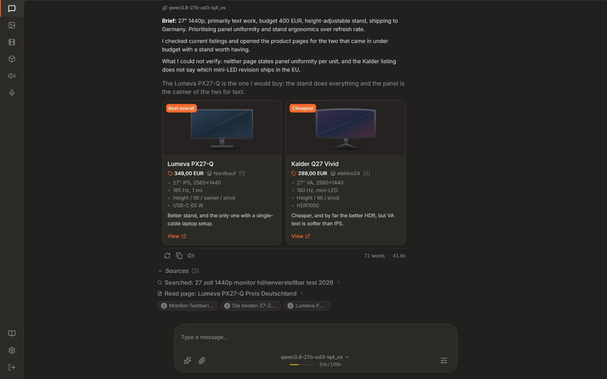 | 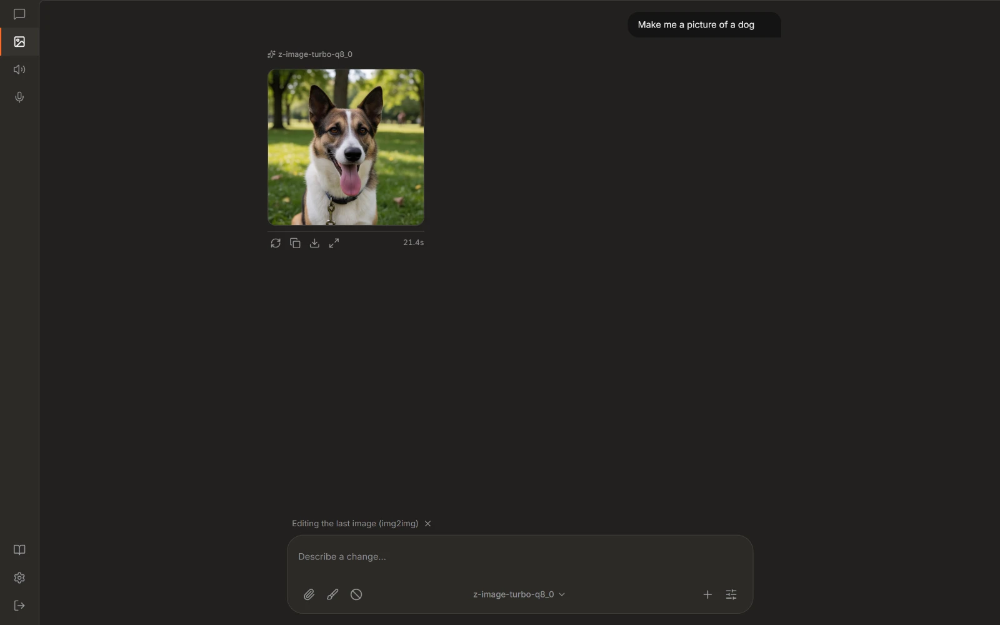 |
| Tool calls and web search, mid-conversation | Diffusion models, driven from the same UI |

## Finding and keeping models

*Find a model, download it, run it.*

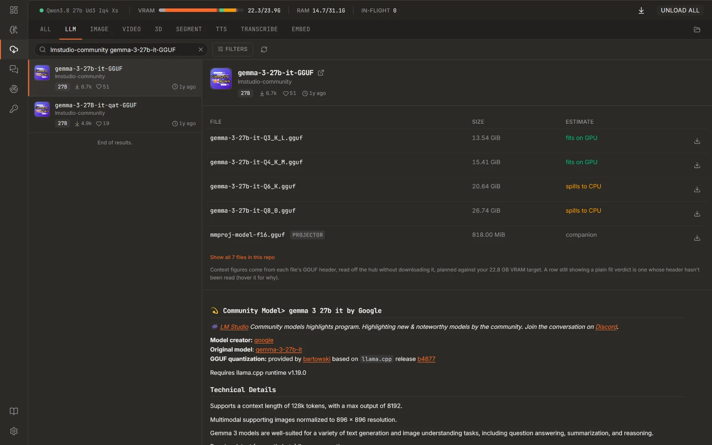

Search Hugging Face from inside the app, compare quants against the VRAM you actually have, and
download into your models folder with the transfer resumable if it breaks. What lands is picked up
and configured without a restart.

- Quants are listed with the fit already worked out, so the pick is not a guess.
- Variants of one GGUF group together instead of flooding the list.
- Text and image models share the catalog and the same management surface.

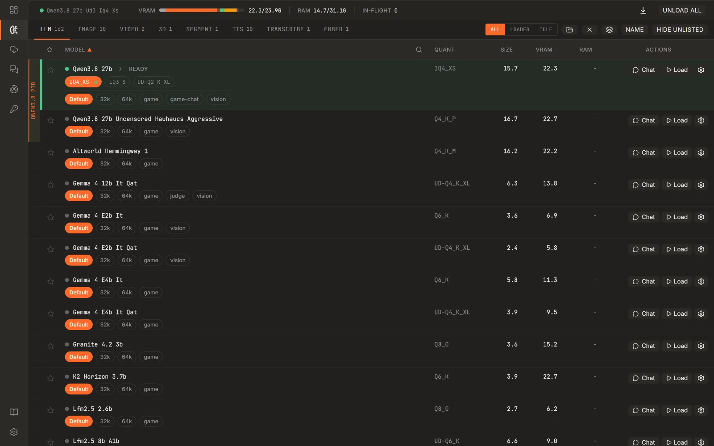

## Bring your own backend

*Any inference server you have, and any repo you follow.*

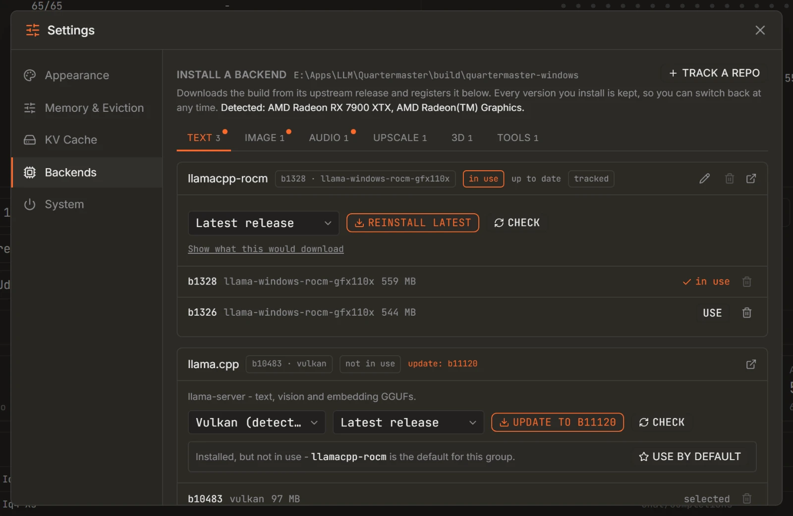

The backends Quartermaster ships with install themselves from their upstream GitHub releases, but
nothing is hard-wired to them. Point a row at a binary you built yourself and it joins the same
registry: picked per model class, launched with the flags the config generates, no different from a
managed install.

- **Track any repo.** Pick one real asset from one real release and the match pattern is derived from
  it: build numbers and dates become wildcards, so next week's build of the same flavour still
  resolves. There is no regex to write.
- **Versioned side by side.** Builds are installed next to each other. Switch which one a backend
  runs, or roll back to the last one that worked, without reinstalling anything.
- **Locally compiled binaries coexist with managed ones**, and an install never quietly steals the
  default from a backend you set up yourself.
- **When a backend will not start**, Quartermaster walks the binary's import table and names the DLL
  that is missing, so a silent `0xC0000135` exit becomes "needs the AMD ROCm/HIP runtime".

## And much more

| | |
|---|---|
| **On-demand model swapping** | One endpoint, every model. A request naming a model that is not loaded swaps it in, evicting whatever no longer fits, and holds a group together when several models have to coexist. |
| **KV-cache that survives eviction** | Snapshots a slot's KV-cache to disk before the model is evicted and restores it when the conversation comes back, so a long chat is not re-prefilled because a throwaway request borrowed the GPU. New conversations can also be seeded from a cached system+tools preamble. |
| **Multi-port catalogs** | Bind several listeners on one shared scheduler, each with its own `/v1/models` view. Loading on one port can evict on another: one process, one GPU accounting. |
| **Concurrent models** | A `matrix` DSL describes which models may run together, so a small always-on model and a large on-demand one can share the card on purpose rather than by luck. |
| **Observe what it is doing** | Activity, streaming logs, per-model performance and context use on one page, so a slow request is something you can look at rather than guess about. |
| **Safe to put on your LAN** | API keys can be scoped to individual models. Bind the API to your tailnet and the dashboard and config endpoints answer to localhost only unless you widen them yourself. |
| **Drivable from the outside** | Prometheus metrics, a log stream you can pipe, ops endpoints to load and unload on demand, and a config file that hot-reloads when you edit it. No plugin system to learn: the surface is HTTP and YAML. |
| **Self-updating** | Release builds poll GitHub, swap the binary in place and relaunch themselves. Local and development builds never phone home. |

## Installation

Windows, Linux, macOS and Docker, from the same single binary. The setup program and the Docker
image bring the inference backends with them; take the bare binary instead and you install them from
Settings on first run, or point at ones you already have.

### Setup program (recommended)

Download the one for your machine from the
[releases page](https://github.com/Quartermaster-Labs/Quartermaster/releases) and run it:
`quartermaster-setup-windows-amd64-vX.Y.Z.exe` on Windows,
`quartermaster-setup-linux-amd64-vX.Y.Z`, `-linux-arm64-` or `-darwin-arm64-` elsewhere (`chmod +x`
it first).

It is a per-user install, so no admin rights, and no UAC prompt on Windows. The wizard:

- asks where to install and fetches the server binary itself, verified against the release checksum,
- downloads the inference backends (`llama-server`, `sd-server`) for your chosen acceleration
  (vulkan, cuda or cpu), so you do not have to hunt them down,
- asks for your models folder and generates a config from what is in it,
- and on Windows optionally adds Start Menu, desktop and logon-autostart shortcuts.

On Windows the window it opens is the app itself, not a browser pointed at localhost. Off Windows
there is no WebView to embed, so the same wizard opens in your default browser on a loopback port,
which is also what you get over ssh with `-browser`. Every step is identical either way.

### Docker

The unified image bundles llama-server, stable-diffusion.cpp, whisper.cpp and
Quartermaster, all built from source. Tags are published per compute backend.

```shell
docker pull ghcr.io/quartermaster-labs/quartermaster:unified-cuda   # or :unified-vulkan

docker run -it --rm --gpus all -p 9292:8080 \
  -v /path/to/models:/models \
  -v /path/to/custom/config.yaml:/etc/quartermaster/config/config.yaml \
  ghcr.io/quartermaster-labs/quartermaster:unified-cuda
```

To build it yourself instead:

```shell
docker/unified/build-image.sh --cuda     # NVIDIA
docker/unified/build-image.sh --vulkan   # AMD and everything else
```

That builds from your working tree, not from a git ref, so what you have checked out is what the
image runs. Expect a long first build: three C++ projects compile from source, and only the Go and
npm stages are quick. Each run pins llama.cpp, whisper.cpp and stable-diffusion.cpp
to a resolved commit, so `LLAMA_REF=b1234 docker/unified/build-image.sh --vulkan` reproduces an
exact combination.

[Published images](https://github.com/Quartermaster-Labs/Quartermaster/pkgs/container/quartermaster)
come from the same build, run on demand from `.github/workflows/unified-docker.yml` (Actions, Build
Unified Docker Image, Run workflow).

### Linux and macOS binaries

The setup program above is the easy path. If you would rather skip it, the server is one static
binary with nothing to install: amd64 and arm64 for Linux, Apple silicon for macOS. Download
`quartermaster-linux-amd64`, `quartermaster-linux-arm64` or `quartermaster-darwin-arm64` from the
[releases page](https://github.com/Quartermaster-Labs/Quartermaster/releases), `chmod +x` it, point
it at your models folder, and install the backends you want from Settings. Verify any download,
wizard included, against the `SHA256SUMS` published beside it. For a headless box, the systemd unit
in [`packaging/systemd`](packaging/systemd) needs only its paths filled in.

These builds are not code-signed, so macOS quarantines them on first run: clear it with
`xattr -d com.apple.quarantine ./quartermaster-darwin-arm64`, or right-click and Open. A binary you
compiled yourself is not quarantined.

### Building from source

Requires Go 1.26+ (see `go.mod`) and Node.js 24 for the UI.

```shell
git clone https://github.com/Quartermaster-Labs/Quartermaster.git
cd quartermaster
make windows        # or: make mac, make linux
```

Each target builds the UI first and leaves the binary in `build/`. For a runnable bundle (binary,
example configs, launcher and service files), use `make package-windows`, `make package-linux` or
`make package-mac`. The Linux and Mac targets also write a `.tar.gz`; on Windows the archive is
opt-in with `make package-windows ZIP=1`, because the bundle directory doubles as a live install and
accumulates gigabytes of downloaded backends that the archive has to exclude.

## Configuration

The smallest config that works:

```yaml
models:
  model1:
    cmd: llama-server --port ${PORT} --model /path/to/model.gguf
```

1. `models` holds all model configurations.
2. `model1` is the ID used in API calls.
3. `cmd` is the command that starts the server.
4. `${PORT}` is a port assigned automatically at launch.

Most setups never write that by hand: `-generate` produces it. Everything else is optional and can be
added one piece at a time.

**Per model**

| Key | What it does |
|---|---|
| `ttl` | Unload the model after N seconds idle |
| `aliases` | Answer to familiar names, for example `gpt-4o-mini` |
| `env` | Extra environment variables for the upstream server |
| `cmdStop` | Graceful stop, which is how Docker and Podman containers want to be shut down |
| `useModelName` | Override the model name sent upstream |
| `filters` | Rewrite requests before they are forwarded: `stripParams`, `setParams`, `setParamsByID` |

**Across models**

| Key | What it does |
|---|---|
| `matrix` | Which models may run concurrently, as a small swap-logic DSL |
| `hooks` | Run things at startup, for example preloading a model |
| `macros` | Reusable snippets, so a shared flag set is written once |
| `listeners` | Several ports on one scheduler, each with its own model catalog |

Every option is documented inline in [`config.example.yaml`](config.example.yaml), which the
installer drops next to your runtime config. Edits hot-reload: the running server swaps its config
and handler in place, without dropping SSE connections, resetting metrics or evicting what is loaded.

## How it works

When a request hits an OpenAI- or Anthropic-compatible endpoint, Quartermaster reads the `model`
value and makes sure the right upstream server is running. If the wrong one is up, it is replaced.
That is the swap. Upstreams are spawned on demand and torn down on their `ttl`, so only what you are
using holds VRAM.

With `-generate`, the config behind that is produced rather than written. Quartermaster discovers
your GGUFs at startup, reads each model's metadata, estimates its VRAM footprint, and computes a
context length, GPU/CPU layer split and KV-cache sizing that fit your hardware. You can tune any of
it afterwards, per model or as named variants, from the web UI or by editing
`quartermaster-generate.yaml`.

In the simplest configuration Quartermaster runs one model at a time. Beyond that, a `matrix` lets
models run concurrently, and multiple listeners give each port a scoped catalog while a single shared
scheduler keeps VRAM accounting honest across all of them.

> **One process, N listeners.** Multi-listener setups and cross-port eviction depend on a single
> shared router and scheduler. Two Quartermaster instances means two schedulers, no shared VRAM
> accounting, and a collision the moment both decide there is room. Run one process with several
> listeners, never several processes.

## API surface

| Family | Endpoints |
|---|---|
| **OpenAI** | `chat/completions`, `responses`, `embeddings`, `models`, audio (`speech`, `transcriptions`, `voices`), images (`generations`, `edits`) |
| **Anthropic** | `messages`, `count_tokens` |
| **llama-server** | `rerank`, `infill`, `completion` |
| **Stable Diffusion** | SDAPI `txt2img`, `img2img`, LoRAs |
| **Quartermaster** | `/v1/segment`, `/v1/images/upscale`, `/v1/tools/*` |
| **Ops** | `/upstream/:model`, `/running`, unload, `/logs[/stream]`, `/health`, `/metrics` (Prometheus) |

Any OpenAI-compatible server works as a backend: llama.cpp, ik_llama.cpp, vLLM, TabbyAPI,
stable-diffusion.cpp, whisper.cpp and others. Upgrade them whenever you like, nothing here is pinned
to a build.

## Operations

### Streaming logs from the CLI

```sh
curl http://host/logs                          # up to the last 10KB
curl -Ns http://host/logs/stream               # combined stream
curl -Ns http://host/logs/stream/proxy         # Quartermaster's own status logs
curl -Ns http://host/logs/stream/upstream      # only the processes it launched
curl -Ns http://host/logs/stream/{model_id}    # only one model
curl -Ns http://host/logs/stream | grep 'eval time'
curl -Ns 'http://host/logs/stream?no-history'  # skip the buffered history
```

### Behind nginx

nginx buffers responses by default, which breaks server-sent events and streaming completions. Turn
buffering off for the streaming routes:

```nginx
location /api/events {
    proxy_pass http://your-quartermaster-backend;
    proxy_buffering off;
    proxy_cache off;
}

location /v1/chat/completions {
    proxy_pass http://your-quartermaster-backend;
    proxy_buffering off;
    proxy_cache off;
}
```

Quartermaster also sets `X-Accel-Buffering: no` on SSE responses as a safeguard, but setting
`proxy_buffering off` explicitly is still the reliable fix.

### Exposing it on a LAN or tailnet

Bind the API to `0.0.0.0` or a tailnet address and the dashboard, ops and config-editor endpoints
answer to the local host only. Those endpoints are deliberately key-free, so a bad API key can never
lock you out of your own UI, which is exactly why they are host-gated instead. Widen the gate with
`-admin-allow 100.64.0.0/10`, or drop it entirely with `-admin-open`.

## FAQ

**Do I have to use llama-server?**
No. Any OpenAI-compatible server works. Quartermaster was originally built around llama-server and
that is the best supported path, but nothing requires it.

**How should I run Python backends like vLLM or TabbyAPI?**
Through Docker or Podman. That gives you clean environment isolation, and containers respond properly
to `SIGTERM`, which matters because Quartermaster stops what it starts.

**Does it phone home?**
No telemetry. Release builds check GitHub for updates, and that is the only outbound call it makes on
its own. Development builds do not even do that.

**Where is the documentation?**
In [`docs/`](docs/), on the [website](https://quartermaster-labs.github.io/Quartermaster/), and
inside the app behind the Help button. All three are generated from the same corpus, and the
playground assistant searches it as a tool.

## License and origins

MIT. Quartermaster started as a fork of [llama-swap](https://github.com/mostlygeek/llama-swap) (MIT)
and has since diverged into its own project: it does not track upstream and has no plan to merge
back.

## Star history

> [!NOTE]
> Thank you to everyone who has given this project a star.

[](https://www.star-history.com/#Quartermaster-Labs/Quartermaster&Date)
